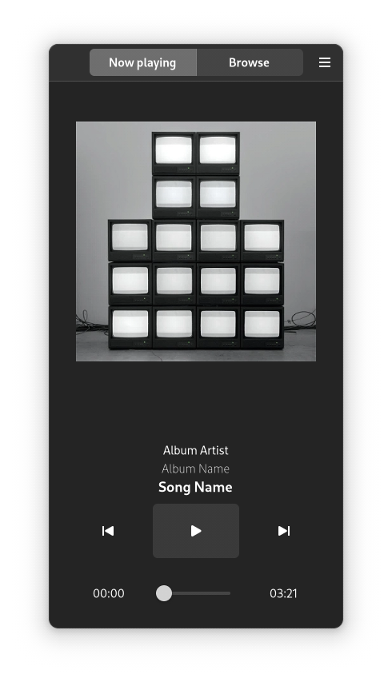

# mphandy

This project is the result of my frustration with GNOME and its music players. Read about it on [my blog](https://k8ie.one/blog/mpd.html).

Be aware, I don't do that much GUI programming. Plus this is my first ever GTK project.

# Status

At this stage the project is more of a GTK playground. I think I got the layout and design nailed down. There is no functionality
implemented yet tho.
I'm a little stuck on having the window staying responsive while doing blocking operations (like talking to MPD).

This is how mphandy looks at this point:

  

